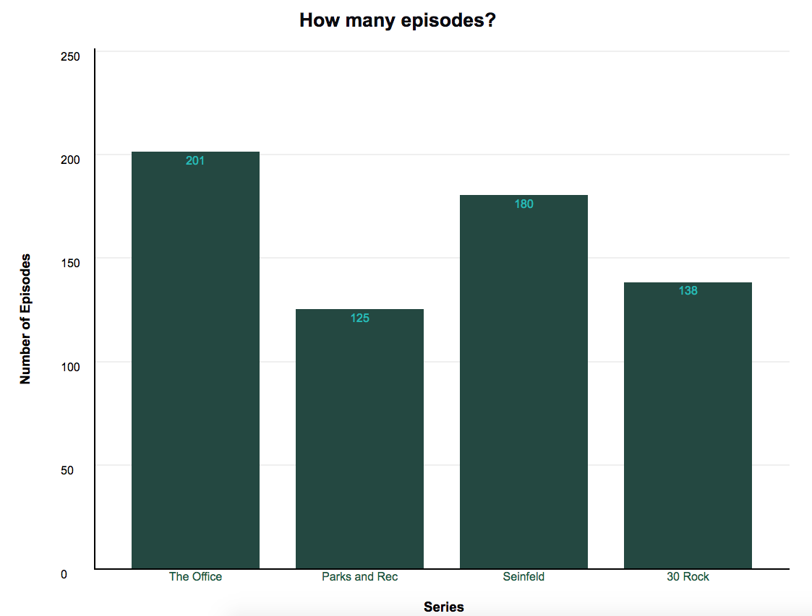
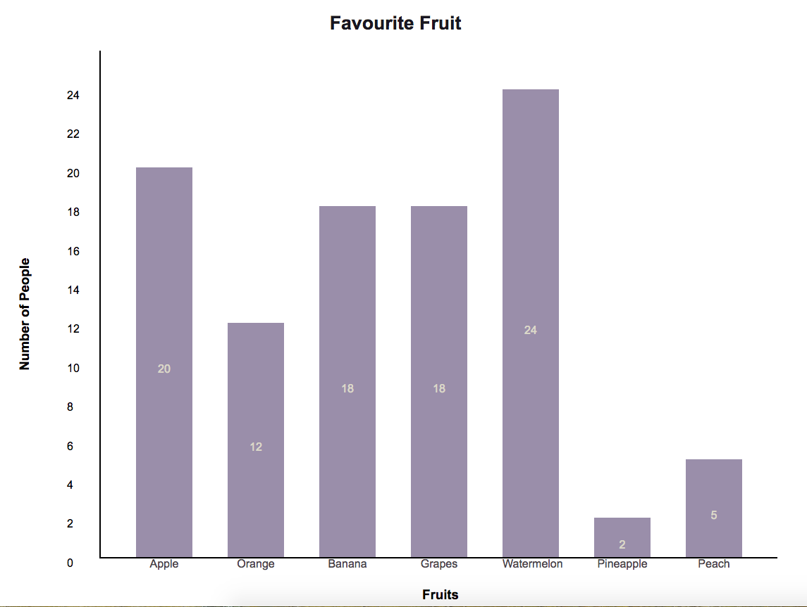
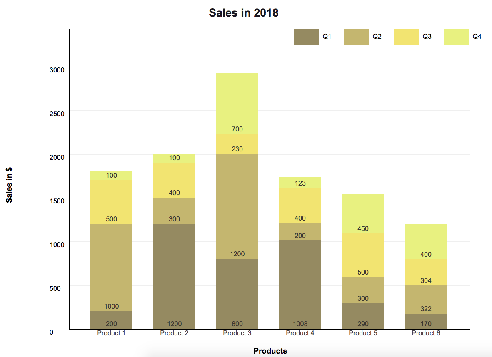

# About
This project utilizes vanilla JavaScript, CSS and JQuery to develop a bar chart with customizable features. This project is part of the Lighthouse Labs Web Development boot-camp prep work. The API can be used to create a vertical bar chart.

# Example Screenshots 

### Example 1 - Single Bar Chart

### Example 2 - Single Bar Chart 

### Example 3 - Stacked Bar Chart

# API Function and parameters

The user should use the following API - 
**drawBarChart(data, options, element)**

### Description of parameters

1. data 
A 2D array which stores the bar chart values. Each array in the 2D array may have multiple values for a stacked bar chart. 
For more details see the examples below -
- Single Bar Chart:
data = [[12],[20],[21]] or
data = [[100],[4243],[32]]

- Stacked Bar Chart:
data = [[200, 1000, 500, 100], [1200,300,400,100], [800,1200,230,700], [1008,200,400,123], [290,300,500,450], [170,322,304,400]] or
data = [[31,13], [13,14]]

2. options
A JSON for customizable features. All the objects are defined below -

  chartwidth -  chart width in pixels, string
  chartheight - chart height in pixels, string

  charttitle -  Chart title, string
  titlefontsize - Title font size in pt or pixels, string
  titlefontcolor - Title font color, string

  datalabels - Data labels for each bar, array

  xaxistitle & yaxistitle - Axes title, string

  barspacing - Spacing between bars in pixel, should be written as "50px"
  barcolour - Bar colours, array of strings. Single bar chart will have a single colour and stacked bar chart will have a colour for each stack. 

  legend - Legend for each stack in a stacked bar chart. Can be left blank for single bar chart.

  xdataposition - All data values are displayed inside the bar. It can be positioned either at the bottom, center or the top. 
  xdatacolour- Colour for the x data display
  datalabelcolor: Data label colour

  yinterval: Interval for displaying the y axis ticks. Interval is in the same units as the data.

  horizontalgrid: Boolean value for display of horizontal gridlines.

3. element
A string value with the element name where the chart will be displayed. 

### Feature List 

1. Chart Dimensions - Chart dimensions (height and width) can be customized. Chart is optimized for 4:3 aspect ratio.

2. Text and Labels - The bar chart displays the following -
    - Chart Title 
    - X and Y axis Title
    - Data Labels
    - Data values
    - Legend (for stacked bar chart)

3. Font and Styling - The text on the chart adopts the font family of the element it is placed in. The font size can be customized for the title. Colour can be customized for the title, data labels and the data values. 

4. Chart Colours - Bar colours can be customized. In a single bar chart all bars will be of the same colour. In stacked bar chart, each stack in all the bars will have the same colour. 

5. Y axis ticks - The space between Y axis ticks can be specified. 

6. Bar spacing - Spacing between bars can be specified. The bar width will be auto-calculated according to the size of the chart and spacing specified. 

7. Horizontal Gridlines - Display of horizontal gridlines can be turned on or off.

### Known Issues / Bugs

1. Multiple bar charts on the same page overlap each other. Only one chart can be displayed on one page.

2. The bar charts may overlap the legend if the stacked bar chart is too high.

3. If the interval is incorrectly selected, the image may be distorted.

4. Chart image is distorted for images less than 800 px by 600 px

### Future Roadmap

1. Chart Animation

2. More customizable features like chart background colour, title colour, different colours for each bar

3. Auto selection of bar width and spacing to best suit the chart display.

4. Validation of data entered and error messages.

### References used:
1. JSON tutorial on W3 Schools
2. JQuery tutorial on freecodecamp.com
2. Stack Overflow resources for various bugs encountered.
3. Flexboxfroggy.com and cssgridgarden.com
4. JQuery documentation
5. MDN documentation

